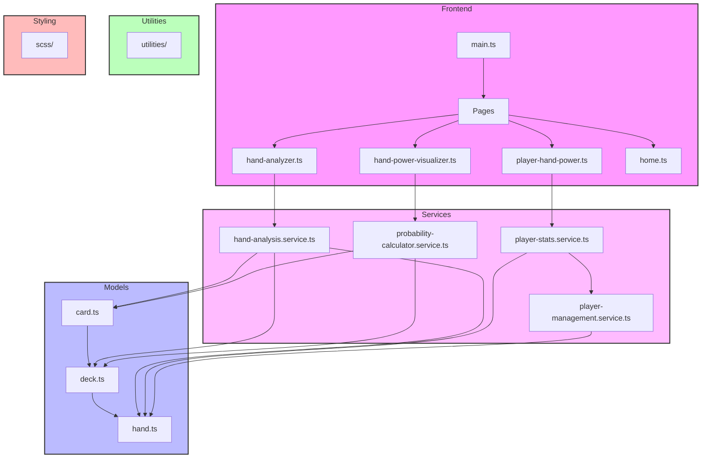

# Architectuur De Leven Kansberekening

Dit document beschrijft de architectuur van het project met behulp van een Mermaid diagram.

## Componenten

### Frontend
- `main.ts`: Het startpunt van de applicatie
- Pages:
  - `hand-analyzer.ts`: Analyseert poker handen
  - `hand-power-visualizer.ts`: Visualiseert hand kracht
  - `player-hand-power.ts`: Toont speler hand kracht
  - `home.ts`: Startpagina

### Services
- `hand-analysis.service.ts`: Bevat de logica voor hand analyse
- `probability-calculator.service.ts`: Bevat kansberekeningen
- `player-stats.service.ts`: Bevat speler statistieken berekeningen
- `player-management.service.ts`: Beheert spelers en hun handen

### Models
- `card.ts`: Definieert kaart structuur en functionaliteit
- `deck.ts`: Beheert kaartspel en kaartoperaties
- `hand.ts`: Definieert de structuur van een poker hand

### Utilities
- Bevat hulpfuncties voor verschillende berekeningen

### Styling
- SCSS bestanden voor styling van de applicatie

## Technische Stack
- TypeScript
- Vite als build tool
- SCSS voor styling
- ESLint voor code kwaliteit

## Voorgestelde Verbeteringen

1. **Services Laag**
   - Scheidt business logica van presentatie
   - Maakt de code beter testbaar
   - Vermindert duplicatie van code
   - Maakt het makkelijker om functionaliteit te hergebruiken

2. **Interface Definities**
   - Toevoegen van TypeScript interfaces voor alle models
   - Duidelijke contracten tussen componenten
   - Betere type checking en IDE ondersteuning

3. **State Management**
   - Overweeg het toevoegen van een state management oplossing (bijv. Zustand of Jotai)
   - Betere controle over applicatie state
   - Makkelijker om complexe data flows te beheren

4. **Error Handling**
   - Centrale error handling strategie
   - Duidelijke error types en messages
   - Betere gebruikersfeedback

5. **Testing Structuur**
   - Unit tests voor services en utilities
   - Integration tests voor belangrijke flows
   - E2E tests voor kritieke gebruikerspaden

6. **Configuratie Management**
   - Centrale configuratie voor verschillende omgevingen
   - Makkelijker om aan te passen voor verschillende use cases
   - Betere scheiding van concerns

7. **Documentatie**
   - API documentatie voor services
   - Component documentatie
   - Setup en deployment instructies

Deze verbeteringen zouden de code beter schaalbaar, testbaar en onderhoudbaar maken, terwijl ze ook de ontwikkelervaring verbeteren. 